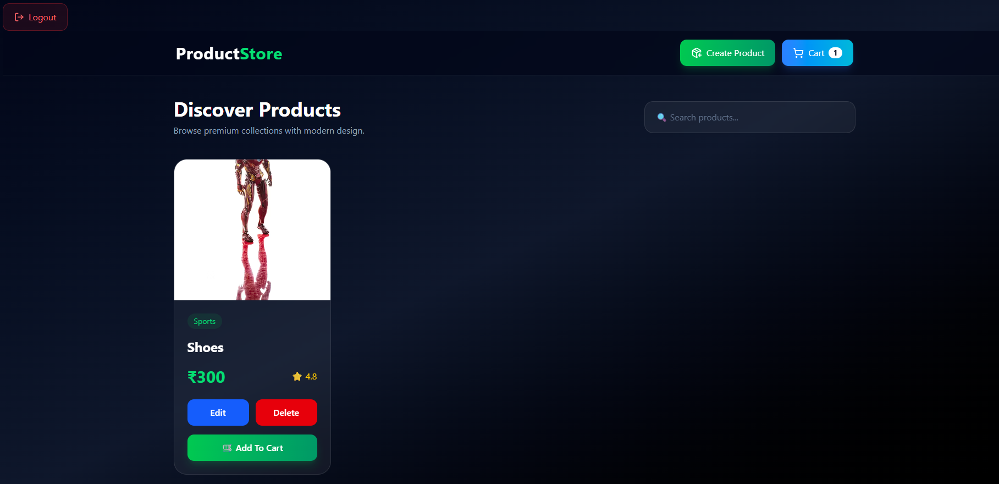
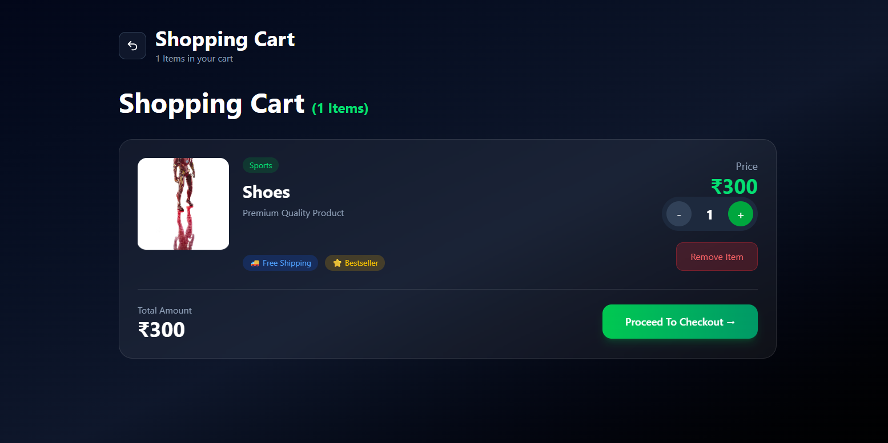
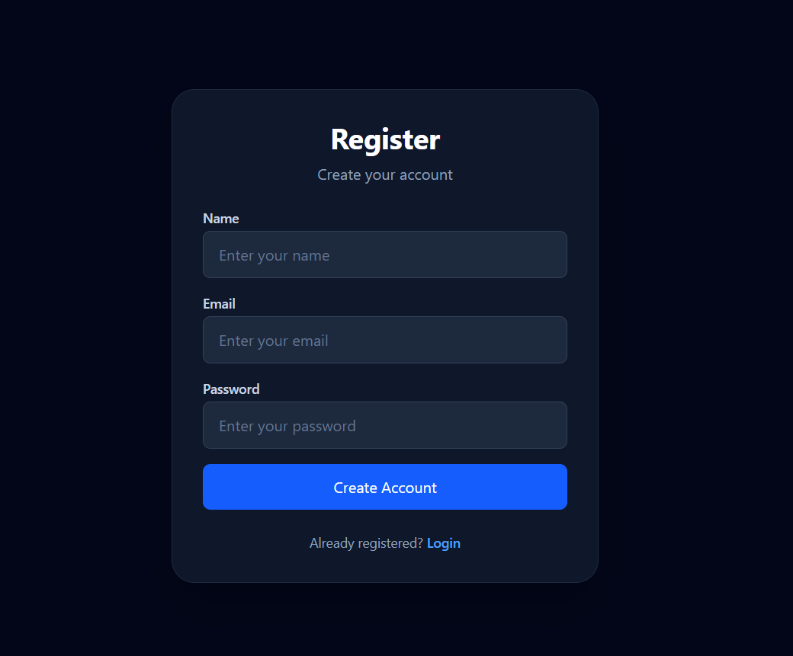

<div align="center">

# 🚀 React Redux & Redux Toolkit

### 📚 Beginner Friendly Learning Notes with Examples & Diagrams


---

> **These notes are written in simple English so beginners can easily understand Redux and Redux Toolkit.**

</div>

---

# 📖 Table of Contents

- Introduction
- Why do we need State?
- Problem with Props Drilling
- What is Redux?
- Why Redux was Created?
- Advantages of Redux
- Redux Architecture
- Store
- State
- Actions
- Reducers
- Data Flow
- Problems with Redux
- What is Redux Toolkit?
- Why Redux Toolkit?
- configureStore()
- createSlice()
- useSelector()
- useDispatch()
- Folder Structure
- Project Example
- Challenges
- Conclusion

---

# 📖 Introduction

When we build applications using **React**, we often need to manage data.

For example,

```jsx
const [count, setCount] = useState(0);
```

or

```jsx
const [user, setUser] = useState({
  name: "Mayur",
});
```

This data is called **State**.

React provides **useState()** to manage state.

For small applications, **useState()** is enough.

But when our application grows bigger, managing state becomes difficult.

Let's understand why.

---

# 🧠 What is State?

State simply means

> **Data that can change over time.**

Examples

- User Name
- Theme
- Login Status
- Shopping Cart
- Products
- Counter
- Todo List

Example

```jsx
const [theme, setTheme] = useState("Dark");
```

Here

Current State

```

Dark

```

After clicking a button

```

Light

```

The value changed.

Therefore it is called **State**.

---

# 🌍 Real Life Example of State

Imagine you are shopping on Amazon.

When you click

```

Add To Cart

```

the cart changes from

```

0 Items

↓

1 Item

↓

2 Items

↓

5 Items

```

That changing value is also a **State**.

---

# 🤔 Why do we need State?

Without State,

our application would never update.

Example

Counter

```jsx
const [count, setCount] = useState(0);
```

Current Screen

```

Count : 0

```

User clicks

```

Increment

```

Now

```

Count : 1

```

State changed,

therefore React automatically updates the UI.

---

# 📦 Sharing State Between Components

Suppose we have

```jsx
const [name, setName] = useState("Mayur");
```

Now another component also needs this value.

We pass it using **Props**.

Example

```jsx
<App>
  <Profile name={name} />
</App>
```

Profile Component

```jsx
function Profile({ name }) {
  return <h1>{name}</h1>;
}
```

This works perfectly.

But only for small applications.

---

# ❌ What is Props Drilling?

Imagine this component hierarchy.

```

App
│
├── Navbar
│
├── Dashboard
│
├── Products
│ │
│ └── ProductDetails
│
└── Profile

```

Now **ProductDetails** needs the user's name.

The data must travel like this.

```

App
│
▼
Navbar
│
▼
Dashboard
│
▼
Products
│
▼
ProductDetails

```

Even though

- Navbar doesn't need it.
- Dashboard doesn't need it.
- Products doesn't need it.

We still have to pass the data.

This process is called

# 👉 Props Drilling

---

# 📊 Props Drilling Diagram

```

                App
                 │
        props(name)
                 │
                 ▼
             Navbar
                 │
        props(name)
                 │
                 ▼
            Dashboard
                 │
        props(name)
                 │
                 ▼
             Products
                 │
        props(name)
                 │
                 ▼
         ProductDetails

```

Notice

Every component is forwarding the same data.

Even if it never uses it.

---

# 😵 Problems with Props Drilling

Props Drilling creates many problems.

### ❌ Too Much Code

Instead of passing data once,

we pass it through many components.

---

### ❌ Difficult to Maintain

If hierarchy changes,

props also change.

---

### ❌ Poor Readability

Large applications become difficult to understand.

---

### ❌ Unnecessary Rendering

Intermediate components receive props

even when they don't use them.

---

### ❌ Difficult Debugging

Finding where data comes from

becomes confusing.

---

# 💡 Solution

Instead of passing data through

```

App
↓

Navbar
↓

Dashboard
↓

Products
↓

ProductDetails

```

Can we keep the data

in one central place?

And allow every component

to access it directly?

Yes.

That is exactly why

# 🚀 Redux was created.

---

# 🤔 What is Redux?

Redux is a

# **State Management Library**

It stores all shared data

inside one central place called

# 🏪 Store

Every component can directly access the Store.

No Props Drilling.

---

# 📊 Redux Architecture

```

                    Redux Store
              ┌───────────────────┐
              │                   │
              │   Global State    │
              │                   │
              └─────────┬─────────┘
                        │
        ┌───────────────┼────────────────┐
        │               │                │
        ▼               ▼                ▼
    Navbar         Products         Profile
        │               │                │
        ▼               ▼                ▼
Notifications    ProductDetails      Settings

```

Now

Every component talks directly

to the Store.

No unnecessary props.

---

# 🔥 Benefits of Redux

✅ No Props Drilling

✅ Clean Code

✅ Easy State Management

✅ Better Scalability

✅ Easy Debugging

✅ Predictable Data Flow

✅ Better Performance

---

# 🧠 Quick Summary

| Without Redux         | With Redux     |
| --------------------- | -------------- |
| Props Drilling        | Global Store   |
| Difficult to Maintain | Easy to Manage |
| Lots of Props         | Direct Access  |
| Large Code            | Cleaner Code   |
| Hard Debugging        | Easy Debugging |

---

# 🎯 What's Next?

Now that we understand

- State
- Props
- Props Drilling
- Redux

In the next section,

we'll understand

✅ Store

✅ Actions

✅ Reducers

✅ Data Flow

before moving to Redux Toolkit.

---

---

# 🏪 What is Store?

Store is the **heart of Redux**.

Think of it like a **big container** where all global data of your application is stored.

Instead of storing important data inside different components,

Redux stores everything inside **one Store**.

Every component can access the Store whenever it needs data.

---

## 📦 Real Life Example

Imagine a school.

Every classroom needs student information.

Instead of every teacher maintaining their own student list,

the school keeps one **Main Database**.

Whenever a teacher needs information,

they simply access the database.

```
                 School Database
          ┌────────────────────────┐
          │                        │
          │  All Student Records   │
          │                        │
          └──────────┬─────────────┘
                     │
      ┌──────────────┼──────────────┐
      ▼              ▼              ▼
  Teacher A      Teacher B      Teacher C
```

Redux Store works exactly like this.

---

## Store Example

```js
{
    auth:{
        isLoggedIn:true,
        user:"Mayur"
    },

    products:[
        {
            id:1,
            title:"Laptop"
        }
    ],

    cart:[
        {
            id:1,
            quantity:2
        }
    ]
}
```

Everything is stored inside one Store.

---

# 🧠 What is State?

State simply means

> **Current Data**

Example

```
Theme = Dark
```

After clicking a button

```
Theme = Light
```

The value changed.

So Theme is a State.

Another example

```
Cart = 2 Products
```

User clicks

```
Add To Cart
```

Now

```
Cart = 3 Products
```

Again,

the data changed,

therefore Cart is also a State.

---

# 🌍 State in Real World

Some common states

```
✔ Login Status

✔ User Name

✔ Theme

✔ Cart Items

✔ Wishlist

✔ Products

✔ Search Value

✔ Counter

✔ Todo List
```

---

# ⚡ What is an Action?

Action tells Redux

## 👉 "What should happen?"

Action does **NOT** change data.

It only describes the work.

Examples

```
Login User

Logout User

Add Product

Delete Product

Update Product

Increase Quantity

Decrease Quantity

Add To Cart

Remove From Cart
```

---

## Action Flow

```
User Clicks Button

↓

dispatch(addProduct())

↓

Action Created

↓

Reducer Runs
```

---

## Example

```jsx
dispatch(addProduct(product));
```

Here

```
addProduct()
```

is an Action.

---

# 📦 What is Payload?

Payload means

## Extra data sent with an Action.

Example

```jsx
dispatch(
  addProduct({
    id: 1,

    title: "iPhone",

    price: 1000,
  }),
);
```

Here

```
{

id:1,

title:"iPhone",

price:1000

}
```

is called the **Payload**.

Reducer receives this payload.

---

# ⚙ What is Reducer?

Reducer is a function

that updates the Store.

Remember

Only Reducers can change State.

No one else.

---

Current Cart

```
2 Products
```

Action

```
Add Product
```

Reducer

```
Cart becomes 3 Products
```

---

## Reducer Example

```jsx
reducers:{

    addProduct(state,action){

        state.products.push(action.payload)

    }

}
```

Let's understand this

```
state
```

Current Data

```
action
```

Information sent by dispatch()

```
action.payload
```

Actual Product

---

# 🎯 State + Action + Reducer

```
Current State

↓

Action

↓

Reducer

↓

New State
```

Example

```
Current Counter

0

↓

Increment

↓

Reducer

↓

Counter = 1
```

---

# 📤 What is Dispatch?

Dispatch is used to send Actions.

Think of Dispatch as

📮 Postman

User clicks

```
Delete Product
```

Dispatch sends

```
Delete Product Action
```

to Reducer.

Reducer updates Store.

---

## Dispatch Example

```jsx
const dispatch = useDispatch();

dispatch(deleteProduct(id));
```

---

# 🔄 Complete Redux Data Flow

Redux always follows

## One Way Data Flow

```
                  User

                    │

                    ▼

          Click Button

                    │

                    ▼

      dispatch(Action)

                    │

                    ▼

             Reducer

                    │

                    ▼

          Update Store

                    │

                    ▼

        useSelector()

                    │

                    ▼

          UI Updates
```

Redux never skips any step.

---

# 🛒 Shopping Cart Example

Current Cart

```
0 Products
```

User clicks

```
Add To Cart
```

Redux Flow

```
Button Click

↓

dispatch(addToCart())

↓

Reducer

↓

Store Updated

↓

Cart = 1 Product

↓

UI Updated
```

---

# ❤️ Login Example

Current State

```
isLoggedIn = false
```

User clicks

```
Login
```

Redux

```
dispatch(login())

↓

Reducer

↓

Store Updated

↓

isLoggedIn = true

↓

Dashboard Opens
```

---

# 📊 Redux Data Flow Diagram

```
                    USER
                      │
                      ▼
             Click Button
                      │
                      ▼
          dispatch(Action)
                      │
                      ▼
             ┌────────────┐
             │ Reducer    │
             └─────┬──────┘
                   │
                   ▼
             Redux Store
                   │
                   ▼
           useSelector()
                   │
                   ▼
             React Component
                   │
                   ▼
             Updated Screen
```

---

# 💡 Important Rules of Redux

✅ Store contains all global data.

✅ State should never be changed directly.

✅ Reducers update State.

✅ Actions describe what should happen.

✅ Dispatch sends Actions.

✅ useSelector reads data.

✅ Redux follows One Way Data Flow.

---

# 🌍 Real World Example

Think about Instagram.

```
❤️ Like Post
```

Flow

```
Click Like

↓

dispatch(likePost())

↓

Reducer

↓

Likes Updated

↓

Store Updated

↓

Screen Updates
```

Same flow is used in

- Amazon
- Flipkart
- Netflix
- Facebook
- Instagram
- Swiggy
- Zomato

---

# 🧠 Summary

| Concept     | Meaning             |
| ----------- | ------------------- |
| Store       | Stores Global State |
| State       | Data                |
| Action      | What should happen  |
| Payload     | Extra Data          |
| Dispatch    | Sends Action        |
| Reducer     | Updates State       |
| useSelector | Reads State         |

---

# 🚀 Next Section

In the next part we will learn

- ❌ Problems with Old Redux
- 🚀 Why Redux Toolkit was introduced
- ⚙ configureStore()
- 🍕 createSlice()
- 📤 useDispatch()
- 📥 useSelector()
- 🧩 Complete Redux Toolkit Architecture
- 💻 Code Examples

---

---

# 🚀 What is Redux Toolkit?

Redux Toolkit (RTK) is the **official and recommended way** to write Redux.

Earlier, developers used **Redux**.

But Redux required writing a lot of unnecessary code.

Redux Toolkit was introduced to make Redux

- Easier
- Faster
- Cleaner
- Beginner Friendly

Today, almost every new React project uses **Redux Toolkit**.

---

# 🤔 Why was Redux Toolkit Introduced?

Old Redux had many problems.

For a small project,

you had to create

```
actions.js

reducers.js

constants.js

types.js

store.js
```

Imagine creating 15-20 features.

You would end up with dozens of files.

Managing those files became difficult.

Redux Toolkit solved this problem.

---

# 📊 Old Redux vs Redux Toolkit

| Old Redux          | Redux Toolkit          |
| ------------------ | ---------------------- |
| Too much code      | Less code              |
| Many files         | Fewer files            |
| Difficult setup    | Easy setup             |
| Boilerplate        | Minimal Boilerplate    |
| Hard for Beginners | Beginner Friendly      |
| Manual Actions     | Auto Generated Actions |

---

# 🧩 Redux Toolkit Architecture

```
                    React App
                        │
                        ▼
                 configureStore()
                        │
                        ▼
                  Redux Store
                        │
        ┌───────────────┼────────────────┐
        ▼               ▼                ▼
   Auth Slice     Product Slice     Cart Slice
        │               │                │
        ▼               ▼                ▼
   Login Logic     CRUD Logic      Cart Logic
```

Instead of creating

```
Actions

Reducers

Types
```

separately,

Redux Toolkit keeps everything together.

---

# 🏪 configureStore()

The first step in Redux Toolkit

is creating the Store.

Redux Toolkit provides

```
configureStore()
```

It automatically creates

✅ Redux Store

✅ Redux DevTools Support

✅ Middleware

✅ Better Performance

---

## Example

```jsx
import { configureStore } from "@reduxjs/toolkit";

import productReducer from "./features/productSlice";

export const store = configureStore({
  reducer: {
    product: productReducer,
  },
});
```

---

## Diagram

```
configureStore()

        │

        ▼

Creates Redux Store

        │

        ▼

Application Ready
```

---

# 🧩 What is Slice?

A Slice is simply

a small part of the Store.

Example

Suppose our application has

```
Authentication

Products

Shopping Cart

Wishlist
```

Instead of putting everything together,

we divide the Store into pieces.

Those pieces are called

# Slice

---

## Example

```
Redux Store

│

├── Auth Slice

├── Product Slice

├── Cart Slice

└── Wishlist Slice
```

Each Slice manages its own data.

---

# 🍕 createSlice()

This is the most important function

inside Redux Toolkit.

It creates

✅ State

✅ Reducers

✅ Actions

automatically.

---

## Syntax

```jsx
const productSlice = createSlice({
  name: "product",

  initialState: [],

  reducers: {},
});
```

---

## Parameters

### name

Every Slice has a unique name.

Example

```jsx
name: "cart";
```

or

```jsx
name: "auth";
```

---

### initialState

Default value of the State.

Example

```jsx
initialState: [];
```

Cart starts empty.

Another example

```jsx
initialState: {
  isLoggedIn: false;
}
```

---

### reducers

Reducers contain all functions

that update the State.

Example

```jsx
reducers:{

    addProduct(){},

    deleteProduct(){},

    updateProduct(){}

}
```

---

# 📦 Complete createSlice Example

```jsx
import { createSlice } from "@reduxjs/toolkit";

const initialState = {
  products: [],
};

const productSlice = createSlice({
  name: "product",

  initialState,

  reducers: {
    addProduct(state, action) {
      state.products.push(action.payload);
    },

    deleteProduct(state, action) {
      state.products = state.products.filter(
        (item) => item.id !== action.payload,
      );
    },
  },
});

export const {
  addProduct,

  deleteProduct,
} = productSlice.actions;

export default productSlice.reducer;
```

---

# 🤔 What happened here?

```
createSlice()

↓

Created Reducers

↓

Created Actions

↓

Created Reducer Function

↓

Exported Everything
```

No need to write Actions manually.

Redux Toolkit creates them automatically.

---

# 📤 What is useDispatch()?

Whenever we want

to change State,

we use

```
useDispatch()
```

Think of Dispatch

like a Delivery Boy.

```
Component

↓

Dispatch

↓

Reducer

↓

Store Updated
```

---

## Example

```jsx
const dispatch = useDispatch();

dispatch(addProduct(product));
```

Here

```
dispatch()
```

sends Action

to the Reducer.

---

# 📥 What is useSelector()?

Whenever we want

to read data,

we use

```
useSelector()
```

It reads data

from the Store.

---

## Example

```jsx
const products = useSelector((state) => state.product.products);
```

Now

products contains

all products

stored inside Redux Store.

---

## Diagram

```
Redux Store

      │

      ▼

useSelector()

      │

      ▼

Component

      │

      ▼

Display Data
```

---

# 🔄 Complete Redux Toolkit Flow

```
                User Click

                     │

                     ▼

      dispatch(addProduct())

                     │

                     ▼

             createSlice()

                     │

                     ▼

                Reducer

                     │

                     ▼

              Update Store

                     │

                     ▼

            useSelector()

                     │

                     ▼

          React Re-renders UI
```

---

# 📦 Folder Structure

```
src

│

├── Components

│

├── Pages

│

├── Redux

│   │

│   ├── store.js

│   │

│   └── features

│        │

│        ├── authSlice.js

│        ├── productSlice.js

│        ├── cartSlice.js

│        └── searchSlice.js

│

├── App.jsx

│

└── main.jsx
```

---

# 🧠 Quick Revision

| Function         | Purpose       |
| ---------------- | ------------- |
| configureStore() | Creates Store |
| createSlice()    | Creates Slice |
| initialState     | Default State |
| reducers         | Updates State |
| useDispatch()    | Sends Actions |
| useSelector()    | Reads State   |

---

# 🎯 Remember

Redux Toolkit doesn't replace Redux.

Redux Toolkit **uses Redux internally**.

It simply provides a much easier and cleaner way to write Redux applications.

Think like this

```
Redux

↓

Powerful Engine

+

Redux Toolkit

↓

Easy Steering Wheel
```

Both work together,

but Redux Toolkit makes the developer's life much easier.

---

---

# 🔗 Connecting React with Redux Toolkit

After creating the Store and Slices, we need to connect Redux with our React application.

Without this step, React cannot access the Redux Store.

Redux provides a component called **Provider**.

The Provider shares the Redux Store with the entire React application.

Think of Provider like a Wi-Fi Router.

```
                 Wi-Fi Router
                      │
        ┌─────────────┼─────────────┐
        ▼             ▼             ▼
     Mobile        Laptop       Smart TV
```

Every device gets Internet from one Router.

Similarly,

```
              Redux Provider
                     │
      ┌──────────────┼──────────────┐
      ▼              ▼              ▼
   Navbar         Products       Cart
```

Every component gets access to the Store.

---

# 📦 Step 1 : Create Store

```jsx
// store.js

import { configureStore } from "@reduxjs/toolkit";

import authReducer from "./features/authSlice";
import productReducer from "./features/productSlice";
import cartReducer from "./features/cartSlice";

export const store = configureStore({
  reducer: {
    auth: authReducer,

    product: productReducer,

    cart: cartReducer,
  },
});
```

---

## 📊 Store Structure

```
Redux Store

│

├── Auth Slice

├── Product Slice

└── Cart Slice
```

Each Slice manages its own State.

---

# 🚀 Step 2 : Wrap React with Provider

```jsx
// main.jsx

import ReactDOM from "react-dom/client";

import { Provider } from "react-redux";

import App from "./App";

import { store } from "./Redux/store";

ReactDOM.createRoot(document.getElementById("root")).render(
  <Provider store={store}>
    <App />
  </Provider>,
);
```

---

## 💡 Why Provider?

Without Provider,

React Components cannot use

```
useSelector()

or

useDispatch()
```

Provider makes the Store available to every component.

---

# 📊 React + Redux Connection

```
              React Application

                     │

                     ▼

          <Provider store={store}>

                     │

                     ▼

              Redux Store

                     │

      ┌──────────────┼──────────────┐

      ▼              ▼              ▼

   Navbar         Products         Cart
```

---

# 🛒 Product Slice

The Product Slice is responsible for managing all Product related data.

### Responsibilities

```
✔ Add Product

✔ Update Product

✔ Delete Product

✔ Display Product

✔ Search Product
```

---

## Product Flow

```
User

│

▼

Fill Product Form

│

▼

Click Add Product

│

▼

dispatch(addProduct())

│

▼

Reducer

│

▼

Store Updated

│

▼

Product List Updated
```

---

## Product Example

```jsx
dispatch(
  addProduct({
    id: 1,

    title: "iPhone",

    price: 999,
  }),
);
```

Reducer receives

```jsx
action.payload;
```

and stores it inside Redux Store.

---

# ✏ Update Product Flow

```
Click Edit

↓

Product Form Opens

↓

Update Information

↓

dispatch(updateProduct())

↓

Reducer

↓

Store Updated

↓

UI Updated
```

---

# 🗑 Delete Product Flow

```
Click Delete

↓

dispatch(deleteProduct(id))

↓

Reducer

↓

Remove Product

↓

Store Updated

↓

UI Updates Automatically
```

---

# 🎯 What I Learned

While creating Product Slice, I learned

✅ CRUD Operations

✅ Updating Arrays

✅ Passing Payload

✅ Filtering Data

✅ State Management

---

---

# 🛒 Cart Slice

The Cart Slice is responsible for managing all cart-related operations.

Instead of managing cart data using **useState()** inside multiple components, Redux Toolkit stores the entire cart inside a global Store.

This allows every component to access and update cart data easily.

---

## 📌 Responsibilities of Cart Slice

```
✅ Add Product to Cart

✅ Remove Product from Cart

✅ Increase Quantity

✅ Decrease Quantity

✅ Calculate Total Items

✅ Display Cart Items

```

---

# 🏗 Cart State

Example

```jsx
const initialState = {
  carts: [],
};
```

After adding products

```jsx
{
  carts: [
    {
      id: 1,

      title: "iPhone",

      quantity: 2,
    },

    {
      id: 2,

      title: "Laptop",

      quantity: 1,
    },
  ];
}
```

Everything is stored inside Redux Store.

---

# 🛍 Add To Cart Flow

When user clicks

```
Add To Cart
```

Redux follows this flow

```
User Click

        │

        ▼

dispatch(addToCart())

        │

        ▼

Cart Reducer

        │

        ▼

Redux Store Updated

        │

        ▼

Cart UI Re-rendered
```

---

## Example

```jsx
dispatch(addToCart(product));
```

Reducer

```jsx
addToCart: (state, action) => {
  state.carts.push({
    ...action.payload,

    quantity: 1,
  });
};
```

---

# ➕ Increase Quantity

When user clicks

```
+
```

Flow

```
User Click

↓

dispatch(increaseQuantity(id))

↓

Reducer

↓

quantity++

↓

Store Updated

↓

Cart Updated
```

Example

Before

```
Laptop

Quantity : 1
```

After

```
Laptop

Quantity : 2
```

---

## Example

```jsx
increaseQuantity: (state, action) => {
  const item = state.carts.find((cart) => cart.id === action.payload);

  item.quantity++;
};
```

---

# ➖ Decrease Quantity

When user clicks

```
-
```

Redux Flow

```
Click -

↓

dispatch(decreaseQuantity(id))

↓

Reducer

↓

quantity--

↓

Store Updated

↓

Updated UI
```

Example

Before

```
Quantity : 5
```

After

```
Quantity : 4
```

---

# ❌ Remove From Cart

Flow

```
Click Delete

↓

dispatch(removeCart(id))

↓

Reducer

↓

Filter Array

↓

Store Updated

↓

Item Removed
```

Example

```jsx
removeCart: (state, action) => {
  state.carts = state.carts.filter((cart) => cart.id !== action.payload);
};
```

---

# 📊 Cart Slice Diagram

```
                    Cart Slice

                         │

         ┌───────────────┼────────────────┐

         ▼               ▼                ▼

    Add Product     Remove Item     Update Quantity

         │               │                │

         └───────────────┼────────────────┘

                         ▼

                   Redux Store

                         │

                         ▼

                     Updated UI
```

---

# 🧮 Quantity Flow

```
Current Quantity

        2

        │

        ▼

Click +

        │

        ▼

Reducer

        │

        ▼

Current Quantity

        3
```

---

# 🔐 Authentication Slice

Authentication Slice manages

```
Register

Login

Logout

Current User

Authentication Status
```

---

## Login Flow

```
User

↓

Enter Email

↓

Enter Password

↓

Click Login

↓

dispatch(login())

↓

Reducer

↓

Store Updated

↓

Navigate Dashboard
```

---

## Logout Flow

```
User Click Logout

↓

dispatch(logout())

↓

Reducer

↓

Clear User Data

↓

Navigate Login Page
```

---

# 📊 Authentication Diagram

```
              Authentication

                    │

      ┌─────────────┼──────────────┐

      ▼             ▼              ▼

   Register       Login         Logout

      │             │              │

      └─────────────┼──────────────┘

                    ▼

               Redux Store

                    ▼

              Updated UI
```

---

# 🔍 Search Functionality

In my project, search is also managed using Redux Toolkit.

Instead of storing the search value inside a local component,

the search keyword is stored globally.

This allows multiple components to access the same search value.

Flow

```
User Types

↓

dispatch(searchProduct())

↓

Store Updated

↓

Filtered Products

↓

Updated UI
```

---

# 💻 Features Implemented

```
✅ Register User

✅ Login User

✅ Logout User

✅ Create Product

✅ Update Product

✅ Delete Product

✅ Search Product

✅ Display Products

✅ Add To Cart

✅ Remove From Cart

✅ Increase Quantity

✅ Decrease Quantity

✅ Responsive Design

✅ React Router

✅ Redux Toolkit
```

---

# 💡 Why I Used Redux Toolkit in This Project

I used Redux Toolkit because multiple pages needed the same data.

For example,

- Product Page
- Cart Page
- Navbar
- Authentication

All of these components shared data with each other.

Instead of passing props through multiple components,

Redux Toolkit made the code much cleaner and easier to maintain.

It also improved the readability of my project and reduced unnecessary code.

---

---

# 📈 Advantages of Redux Toolkit

Redux Toolkit provides many benefits compared to traditional state management.

### Key Advantages

- 🚀 Less Boilerplate Code
- 📦 Easy Store Configuration
- 🧩 Automatic Action Creators
- ⚡ Better Performance
- 📁 Organized Folder Structure
- 🔄 Predictable State Management
- 🛠 Built-in Redux DevTools Support
- 📚 Officially Recommended by Redux Team
- 💡 Easy to Learn for Beginners
- 📈 Scalable for Large Applications

---

# ⚠ Challenges I Faced

While learning Redux Toolkit, I faced several challenges.

- Understanding Redux Data Flow
- Difference between Redux and Redux Toolkit
- Connecting Store with React
- Understanding createSlice()
- Passing Payload Correctly
- Updating Objects inside Arrays
- Managing Cart Quantity
- Handling Authentication State
- Debugging Reducers
- Organizing Multiple Slices

After reading the official documentation and building my own project, these concepts became much clearer.

---

# 💡 What I Learned

This project helped me understand many important concepts of state management.

### I learned

- What Redux is
- Why Redux Toolkit was introduced
- What is Global State
- What is a Store
- What is a Slice
- What are Reducers
- What are Actions
- What is Payload
- How configureStore() works
- How createSlice() works
- How useSelector() reads data
- How useDispatch() updates data
- Redux One-Way Data Flow
- Managing Large Applications
- Building CRUD Applications using Redux Toolkit

---

# 📂 Project Folder Structure

```text
src
│
├── Components
├── Pages
├── Redux
│   ├── store.js
│   └── features
│       ├── authSlice.js
│       ├── productSlice.js
│       ├── cartSlice.js
│       └── searchSlice.js
│
├── App.jsx
├── main.jsx
└── index.css
```

---

# 🛠 Tech Stack

| Technology        | Purpose              |
| ----------------- | -------------------- |
| React.js          | Frontend             |
| Redux Toolkit     | State Management     |
| React Redux       | Redux Integration    |
| React Router      | Routing              |
| JavaScript (ES6+) | Programming Language |
| Tailwind CSS      | Styling              |
| Vite              | Build Tool           |

---

# 📸 Project Preview

## 🏠 Home Page



## 🛒 Cart Page





## ®️ Register Page

---

# 📚 References

- Redux Toolkit Official Documentation
- React Official Documentation
- Redux DevTools
- JavaScript ES6 Documentation

---

# 🏁 Conclusion

Before learning Redux Toolkit, I used **useState()** and **Props** to manage data.

As my application became larger, Props Drilling made the code difficult to maintain.

Redux Toolkit solved this problem by providing a centralized Store where every component can access shared data directly.

Building this project helped me understand not only Redux Toolkit but also how professional React applications manage state efficiently.

This challenge also improved my documentation reading skills, debugging ability, and confidence in learning new technologies independently.

---

# ❤️ Acknowledgement

Special thanks to **Sheryians Coding School** for creating this challenge.

This challenge encouraged me to learn beyond classroom lectures, explore official documentation, build a complete project, and explain my understanding in my own words.

---

# 👨‍💻 Author

**Sanjay Vaishnav Bairagi**

Frontend Developer | React Learner

---

<div align="center">

## ⭐ Thank You for Visiting ⭐

If you found this project helpful, don't forget to give it a ⭐ on GitHub.

Happy Coding ❤️🚀

</div>
